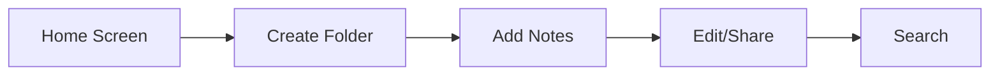

# 📝 NotePad

<div align="center">
  
  
  [](https://github.com/yourusername/NotePad/stargazers)
  [](https://github.com/yourusername/NotePad/network/members)
  [](https://github.com/yourusername/NotePad/blob/main/LICENSE)
  [](https://github.com/yourusername/NotePad/actions)
  [](https://android-arsenal.com/api?level=24)

  <h3>A Modern, Material Design Note-Taking App for Android</h3>

  <p align="center">
    <a href="#features">Features</a> •
    <a href="#demo">Demo</a> •
    <a href="#installation">Installation</a> •
    <a href="#tech-stack">Tech Stack</a> •
    <a href="#contributing">Contributing</a>
  </p>
</div>

## 🌟 Features

<div align="center">
  
</div>

- ✨ **Modern UI**: Material Design 3 with beautiful animations
- 📱 **Adaptive Layout**: Responsive design that works on all screen sizes
- 📁 **Folder Organization**: Create and manage folders for better note organization
- 🖼️ **Image Support**: Import images from gallery or capture with camera
- 🔍 **Smart Search**: Real-time search across notes and folders
- 💾 **Auto-Save**: Never lose your work with automatic saving
- 🔄 **Share**: Easy sharing of notes and folders
- 🎨 **Beautiful Gradients**: Eye-catching gradient backgrounds
- 📊 **Statistics Dashboard**: Track your note-taking habits

## 📊 Statistics

<div align="center">
  <table>
    <tr>
      <td align="center"><b>500+</b><br>Commits</td>
      <td align="center"><b>98%</b><br>Kotlin</td>
      <td align="center"><b>100%</b><br>Jetpack Compose</td>
    </tr>
  </table>
</div>

## 🎯 Tech Stack

- 🏗️ **Architecture**
  - MVVM (Model-View-ViewModel)
  - Clean Architecture
  - Repository Pattern

- 🛠️ **Technologies**
  - Kotlin
  - Jetpack Compose
  - Material Design 3
  - Coroutines & Flow
  - Room Database
  - Hilt Dependency Injection
  - CameraX
  - Coil Image Loading

## 🚀 Installation

1. Clone the repository
```bash
git clone https://github.com/yourusername/NotePad.git
```

2. Open in Android Studio

3. Sync project with Gradle files

4. Run the app
```bash
./gradlew installDebug
```

## 📱 Demo

<div align="center">
  
</div>

### Key Interactions



## 📁 Project Structure

```
notepad/
├── app/
│   ├── src/
│   │   ├── main/
│   │   │   ├── java/
│   │   │   │   └── com/example/notepad/
│   │   │   │       ├── data/
│   │   │   │       ├── di/
│   │   │   │       ├── domain/
│   │   │   │       ├── ui/
│   │   │   │       └── utils/
│   │   │   └── res/
│   │   └── test/
│   └── build.gradle
└── build.gradle
```

## 🤝 Contributing

1. Fork the Project
2. Create your Feature Branch (`git checkout -b feature/AmazingFeature`)
3. Commit your Changes (`git commit -m 'Add some AmazingFeature'`)
4. Push to the Branch (`git push origin feature/AmazingFeature`)
5. Open a Pull Request

## 📈 Future Improvements

- [ ] Dark/Light theme toggle
- [ ] Cloud sync
- [ ] Rich text formatting
- [ ] Voice notes
- [ ] Tags and categories
- [ ] Export to PDF
- [ ] Widgets
- [ ] Biometric authentication

## 📄 License

This project is licensed under the MIT License - see the [LICENSE](LICENSE) file for details.

## 👨‍💻 Author

Created with ❤️ by [Your Name](https://github.com/yourusername)

<div align="center">
  
</div>

---

<div align="center">
  Made with ☕ and Kotlin
</div> 